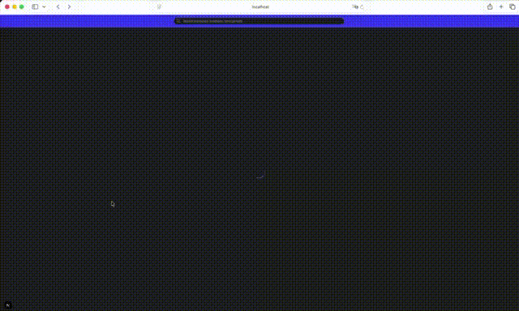

# White Rabbit

> *"You take the blue pill - the story ends, you wake up in your bed and believe whatever you want to believe. You take the red pill - you stay in Wonderland and I show you how deep the rabbit hole goes"* - Morpheus [Matrix]



## Overview

White Rabbit is an interactive web application for exploring the world's unsolved mysteries through a knowledge graph powered by Neo4j. Discover connections between mysterious events, locations, time periods, and categories through an intuitive visual interface.

> **DISCLAIMER:** Mysteries are mysteries for a reason - the information presented is not fact but rather documented unexplained phenomena for educational and entertainment purposes.

## Key Features

- **Interactive Knowledge Graph** - Visualize mysteries as an interconnected network of nodes using Neo4j NVL
- **Global Search** - Full-text search across mysteries, locations, time periods, and categories
- **Mystery Details Panel** - View detailed information including images, videos, and related mysteries
- **Text-to-Speech** - Listen to mystery descriptions with AI-generated narration (Kokoro-82M)
- **Filter by Context** - Click any node to filter mysteries by location, time period, or category
- **Similar Mysteries** - Discover related mysteries with confidence-scored recommendations
- **Responsive Design** - Optimized for both desktop and mobile experiences

## Tech Stack

### Frontend

| Technology | Version | Purpose |
|------------|---------|---------|
| [Next.js](https://nextjs.org/) | 16.1 | React framework with App Router |
| [React](https://react.dev/) | 19.2 | UI library |
| [TypeScript](https://www.typescriptlang.org/) | 5.x | Type-safe JavaScript |
| [Tailwind CSS](https://tailwindcss.com/) | 4.x | Utility-first styling |
| [Zustand](https://zustand-demo.pmnd.rs/) | 5.x | State management |
| [Neo4j NVL](https://neo4j.com/docs/nvl/current/) | 1.x | Graph visualization |
| [next-intl](https://next-intl-docs.vercel.app/) | 4.x | Internationalization |

### Backend

| Technology | Version | Purpose |
|------------|---------|---------|
| [FastAPI](https://fastapi.tiangolo.com/) | Latest | Python web framework |
| [Neo4j](https://neo4j.com/) | 5.x | Graph database |
| [Kokoro](https://github.com/hexgrad/kokoro) | 0.9.2+ | Text-to-Speech engine |
| [Pydantic](https://docs.pydantic.dev/) | 2.x | Data validation |
| [Uvicorn](https://www.uvicorn.org/) | Latest | ASGI server |

### AI/ML Model

| Model | Parameters | Purpose |
|-------|------------|---------|
| [Kokoro-82M](https://huggingface.co/hexgrad/Kokoro-82M) | 82M | Text-to-Speech synthesis |

Kokoro-82M is a lightweight, CPU-optimized TTS model that provides high-quality narration with multiple voice options (American & British English). It runs efficiently on consumer hardware without requiring a GPU.

## Database Schema

```
┌─────────────┐     ┌─────────────┐     ┌─────────────┐
│   Mystery   │────▶│  Location   │     │  Category   │
│             │     │             │     │             │
│ - id        │     │ - id        │     │ - id        │
│ - title     │     │ - name      │     │ - name      │
│ - status    │     │ - country   │     └─────────────┘
│ - score     │     │ - lat/lng   │            ▲
│ - images    │     └─────────────┘            │
│ - videos    │            ▲                   │
│ - years     │            │                   │
└─────────────┘            │                   │
       │                   │                   │
       │      ┌────────────┴───────────────────┘
       │      │
       ▼      ▼
┌─────────────────┐
│   TimePeriod    │
│                 │
│ - id            │
│ - label         │
│ - start_year    │
│ - end_year      │
└─────────────────┘
```

### Node Types

| Node | Description | Properties |
|------|-------------|------------|
| **Mystery** | Unsolved mystery or phenomenon | id, title, status, confidence_score, image_source, video_source, first_reported_year, last_reported_year |
| **Location** | Geographic location | id, name, latitude, longitude, country |
| **TimePeriod** | Historical time period | id, label, start_year, end_year |
| **Category** | Mystery classification | id, name |

### Relationships

- `Mystery` → `LOCATED_AT` → `Location`
- `Mystery` → `OCCURRED_DURING` → `TimePeriod`
- `Mystery` → `BELONGS_TO` → `Category`
- `Mystery` → `SIMILAR_TO` → `Mystery`

## Quick Start

### Prerequisites

- Node.js 18+
- Python 3.11+
- Neo4j Database (local or cloud)

### Frontend Setup

```bash
cd web
npm install
npm run dev
```

The frontend will be available at `http://localhost:3000`

### Backend Setup

```bash
cd api
pip install -e .
uvicorn src.main:app --reload
```

The API will be available at `http://localhost:8000`
- API Documentation: `http://localhost:8000/docs`

### Database Setup

1. Create a Neo4j database (local or [Aura](https://neo4j.com/cloud/aura/))
2. Run the fulltext index creation script:
   ```cypher
   // See api/docs/create_fulltext_index.cypher
   CREATE FULLTEXT INDEX globalSearch IF NOT EXISTS
   FOR (n:Mystery|Location|TimePeriod|Category)
   ON EACH [n.title, n.name, n.label];
   ```

### Environment Variables

Create `.env` files in both `web/` and `api/` directories:

```bash
# api/.env
NEO4J_URI=bolt://localhost:7687
NEO4J_USER=neo4j
NEO4J_PASSWORD=your_password
TTS_DEFAULT_VOICE=bm_fable
```

```bash
# web/.env.local
NEXT_PUBLIC_API_URL=http://localhost:8000
```

## API Endpoints

| Method | Endpoint | Description |
|--------|----------|-------------|
| GET | `/api/graph` | Fetch all nodes and relationships |
| GET | `/api/mysteries` | List mysteries with pagination |
| GET | `/api/mysteries/{id}` | Get mystery details |
| GET | `/api/search?q=` | Full-text search |
| GET | `/api/filter/{id}` | Filter mysteries by node |
| POST | `/api/tts` | Generate TTS audio |
| GET | `/api/tts/voices` | List available voices |
| GET | `/api/health` | Database health check |
| GET | `/api/tts/health` | TTS service health check |

## Development

```bash
# Frontend
cd web
npm run dev      # Start dev server
npm run build    # Production build
npm run lint     # Run ESLint

# Backend
cd api
uvicorn src.main:app --reload  # Start dev server
pytest                          # Run tests
```

## Project Structure

```
white_rabbit/
├── web/                    # Next.js frontend
│   ├── app/               # App Router pages
│   ├── components/        # React components
│   ├── store/             # Zustand stores
│   ├── hooks/             # Custom React hooks
│   ├── types/             # TypeScript types
│   └── utils/             # Utility functions
├── api/                    # FastAPI backend
│   ├── src/
│   │   ├── routers/       # API route handlers
│   │   ├── services/      # Business logic
│   │   ├── schemas/       # Pydantic models
│   │   └── main.py        # Application entry
│   ├── tests/             # Integration tests
│   └── docs/              # API documentation
└── resources/              # Static assets & demos
```

## Roadmap

### Phase 1 (MVP) - Completed

- [x] Neo4j database schema design
- [x] FastAPI backend with CRUD operations
- [x] Next.js frontend with graph visualization
- [x] Mystery details modal with images/videos
- [x] Full-text search across all node types
- [x] Text-to-Speech narration with Kokoro-82M
- [x] Filter by location, time period, category

### Phase 2 (Enhancements) - In Progress

- [ ] User authentication
- [ ] Mystery submission system
- [ ] Community discussions
- [ ] Advanced filtering options
- [ ] Map-based exploration
- [ ] Timeline visualization

## Contributing

Contributions are welcome! Please feel free to submit a Pull Request.

## License

This project is for educational purposes. See individual mystery sources for attribution.

## Acknowledgments

- [Neo4j](https://neo4j.com/) for the graph database
- [Kokoro](https://github.com/hexgrad/kokoro) for the TTS model
- All the researchers and documentarians who have investigated these mysteries

---

*"The mystery of life isn't a problem to solve, but a reality to experience."* - Frank Herbert
